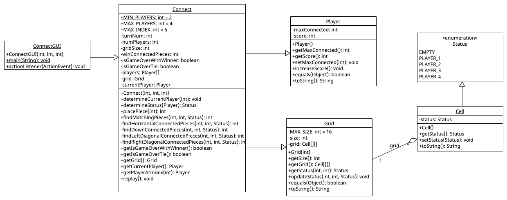
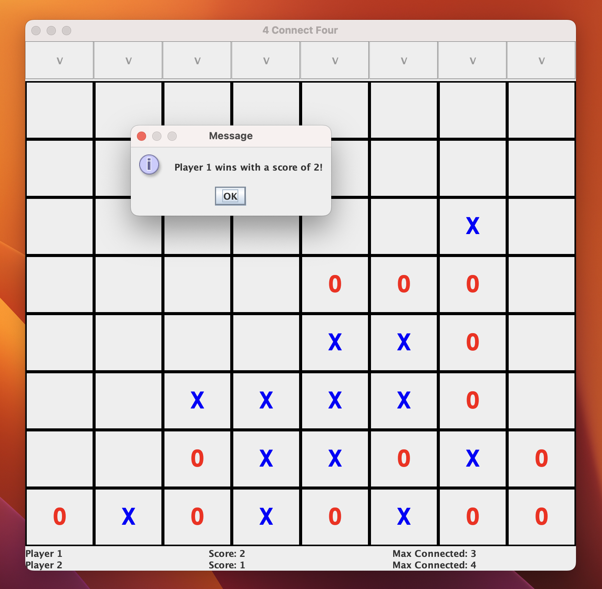
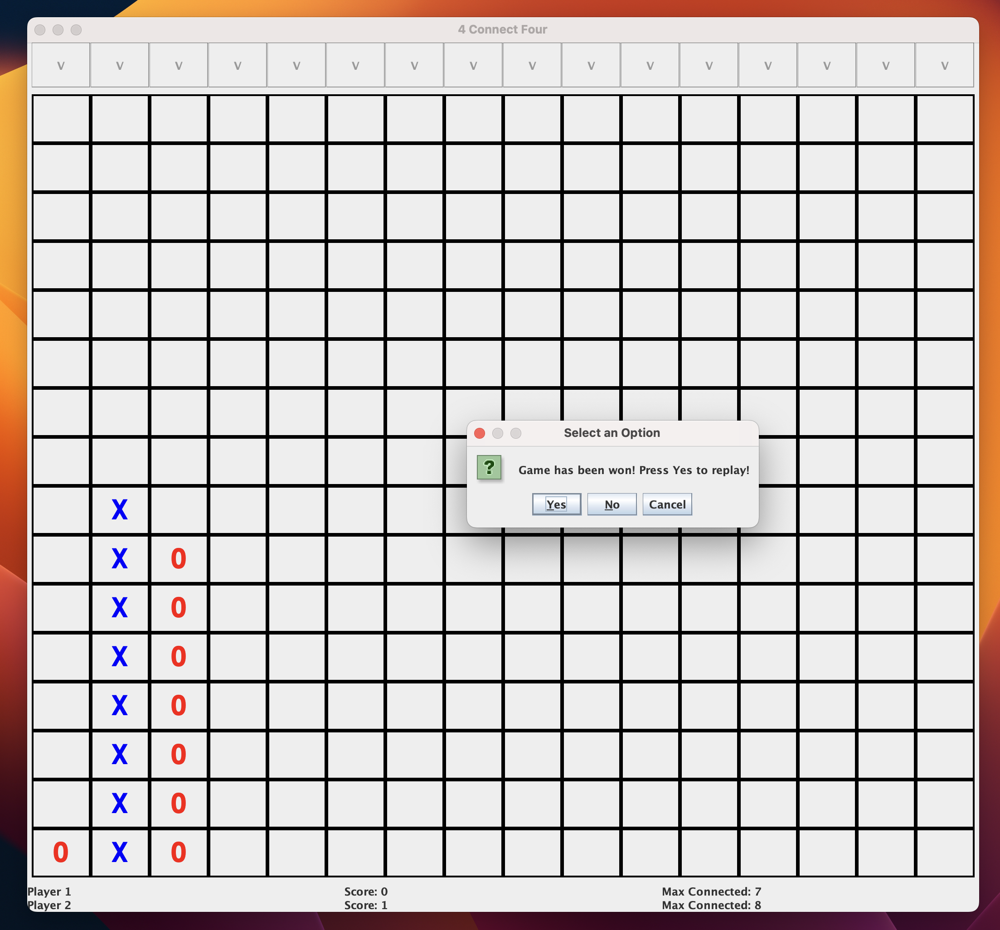
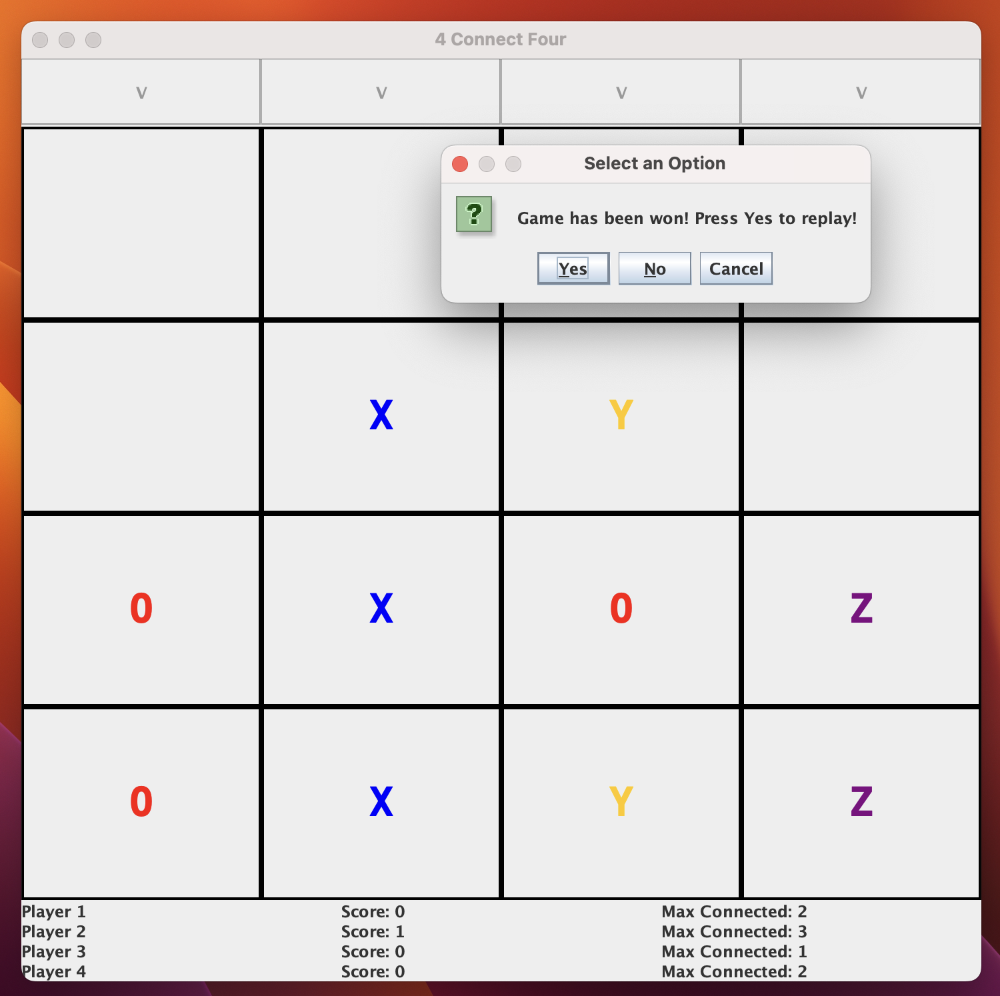
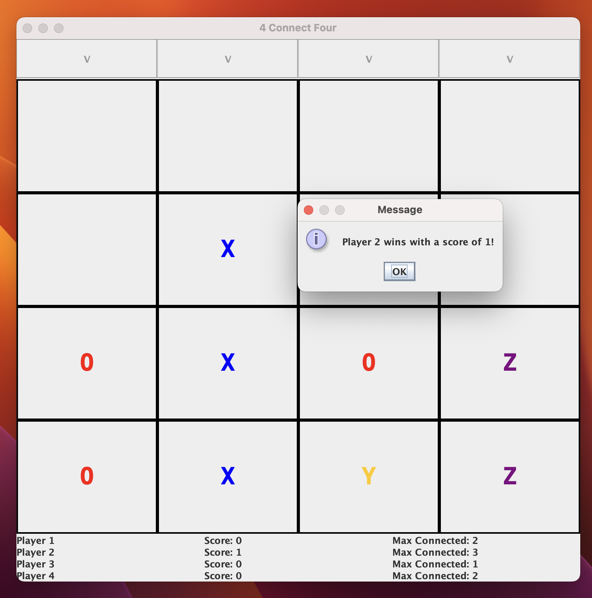

# Connect4

### *Note:* This project was completed as a part of the NC State's CSC-116 course cirriculum.

This was a group project, created outside GitHub. Contributors are: [Ethan Perez](https://github.com/ethan-d-perez), [Talha Djibril](), and Aidan Graves

### Introduction

This project is a fun spin on the classic game *[Connect4](https://en.wikipedia.org/wiki/Connect_Four)*. In this version of the game, while there is still a grid, players, and turns, players now have the ability to customize these elements. Players can choose grid size (3x3 - 16x16), player count (2 - 4), and the number of connected pieces required to win (1-16), which drastically changes the way the game is played. This allows players to play around with hundreds of different game options and create a game they enjoy the most. And when the game is over, player stats and wins are recorded, so the game can stay competitive!

Some interesting options are a 3x3 grid with two players--a game of tic-tac-toe with gravity!--and a 16x16 grid with four players, really pushing the limits of the game!

### Design

This version of Connect4, was meant to exercise the stengths and limitations of Java. Because of Java's static and strongly typed architecture, creative workarounds had to be developed. Connect4, as a project, was designed to introduce object-oriented design to a unorthodox system, and explore creative strongly-typed solutions to logic problems. This has a model-view-controller architecture, with the game logic being handled by the controller (Connect4), design and structure handled by the models (Cell, Player, Grid, etc.), and view handled by the GUI (ConnectGUI).

 

## Images

 

A typical game can be played (two players, 7-wide grid, and 4 pieces to win).

 

Game can be customized to have a large board (16x16 max). Note that the player has won in this match with 8 pieces. Larger boards can be compensated with a larger win condition, creating a much more strategic and high-impact game environment.

 

A game can be played with four players. Note that the player has won in this game with only three pieces. Smaller boards can be played with fewer connected pieces as a win condition creating a more possessive match for board space.

 

The game will keep track of player progress, including wins and connected pieces during the game and subsequent plays.

 

## How to play

Download the files and run these commands in the terminal while in the project directory:

 

>compile:\
>$ javac -d bin src/Cell.java\
>$ javac -d bin -cp bin src/Grid.java\
>$ javac -d bin -cp bin src/Player.java\
>$ javac -d bin -cp bin src/Connect.java\
>$ javac -d bin -cp bin src/ConnectGUI.java\
>
>run:\
>$ java -cp bin ConnectGUI gridSize winConnectedPieces numPlayers
>
>compile all:\
>$ javac -d bin -cp bin src/.*java\

